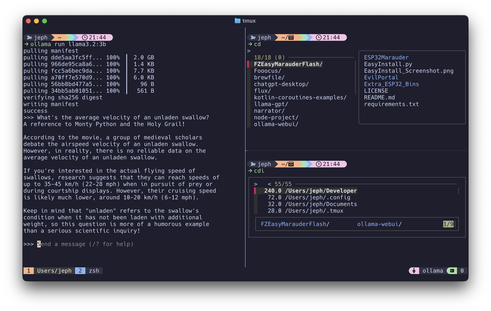

# zsh config

This is my personal zsh config. I made this so I don't have to learn
how to set up zsh again every time I get a new computer. Feel free to
use it if you'd like, but keep in mind some aspects of the config, such
as the `git` setup are specific to me.



## Setup

Setup is specific to macOS

### Basic zsh and Oh My Zsh installation

Install zsh (Consider installing all packages and applications using a `Brewfile`
such as [this](https://github.com/jeph/brewfile))

```zsh
brew install zsh
```

Set zsh as the default shell in macOS. This isn't necessary for recent
macOS versions.

```zsh
sudo sh -c "echo $(which zsh) >> /etc/shells"
chsh -s $(which zsh)
```

### .zshrc setup

Clone the repo and copy `.zshrc` file for Oh My Zsh to access.
You'll have to copy again if you ever change the `.zshrc` file here.

```zsh
git clone https://github.com/jeph/zsh-config.git
cd zsh-config
cp $PWD/.zshrc $HOME/.zshrc
source $HOME/.zshrc
```

## Additional Setup (Optional)

### Set up git aliases

```zsh
# git setup
git config --global user.name "Jeph Liu"
git config --global user.email jephliu@jeph.io

# Common git aliases
git config --global alias.co checkout
git config --global alias.br branch
git config --global alias.ci commit
git config --global alias.st status
git config --global alias.unstage 'reset HEAD --'
git config --global alias.last 'log -1 HEAD'
git config --global alias.uncommit 'reset HEAD~1'
```
